# ecs

* TOC

  {:toc}

This guide shows you how you can easily deploy Portworx on Amazon Elastic Container Service [**ECS**](https://aws.amazon.com/ecs/)

## Step 1: Create an ECS cluster

In this example, we create an ECS cluster called `ecs-demo1` using default AWS AMI \(ami-b2df2ca4\) and create two EC2 instances in the US-EAST-1 region.

As of this guide is written, the default ECS AMI uses Docker 1.12.6. Note that Portworx recommends a minimum cluster size of 3 nodes.

### Create the cluster in the console

Log into the ECS console and create an ecs cluster called "ecs-demo1".

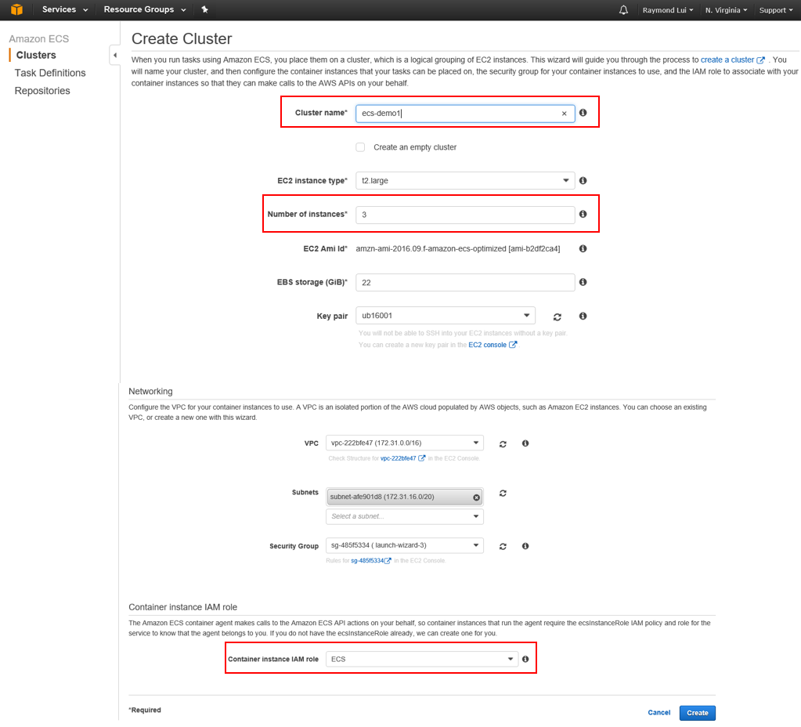{:width="1023px" height="928px"}.

On above, the Container Instance IAM role is used by the ECS container agent. These ECS container agent is deployed by default with the EC2 instances from the ECS wizard. And these agent makes call to AWS ECS API actions on your behalf, thus these EC2 instances that running the ECS container agent require an IAM role that has permission to join ECS cluster and launch containers within the cluster.

Create a custom IAM role and Select Role Type "Amazon EC2 Role for Container Service". This is the minimal required permission to launch ECS cluster. And depends on your use case, you may need additional AWS policy for your ECS to access and use other AWS resources. The "AmazonEC2ContainerServiceRole" has the policy shown below:

```text
{
    "Version": "2012-10-17",
    "Statement": [
      {
        "Effect": "Allow",
        "Action": [
        "ec2:AuthorizeSecurityGroupIngress",
        "ec2:Describe*",
        "elasticloadbalancing:DeregisterInstancesFromLoadBalancer",
        "elasticloadbalancing:DeregisterTargets",
        "elasticloadbalancing:Describe*",
        "elasticloadbalancing:RegisterInstancesWithLoadBalancer",
        "elasticloadbalancing:RegisterTargets"
         ],
        "Resource": "*"
      }
      ]
 }
```

Use the created custom IAM role `ECS` for this ECS cluster and the security group should allow inbound ssh access from your network.

Your EC2 instances must have the correct IAM role set. Follow these [IAM instructions](http://docs.aws.amazon.com/AmazonECS/latest/developerguide/instance_IAM_role.html).

After the ECS cluster "ecs-demo1" successfully launched, the corresponding EC2 instances that belong to this ECS cluster can be found under the "ECS instance" tab of ECS console or from AWS EC2 console. Each of this EC2 instance is running with an amazon-ecs-agent in docker container.

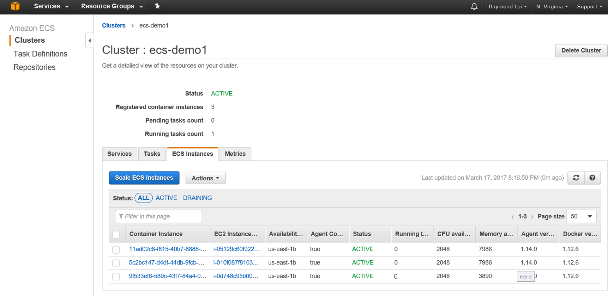{:width="1723px" height="863px"}.

### Add storage capacity to each EC2 instance

Provisioning storage to these EC2 instances by creating new EBS volumes and attaching them to these EC2 instances. Portworx will be using these EBS volumes to provision storage to your containers. Below we are creating a 20GB EBS volume on the same region "us-east-1b" of the launched EC2 instances. Ensure all ECS instances are attached with the EBS volumes.

{:width="1831px" height="580px"}.

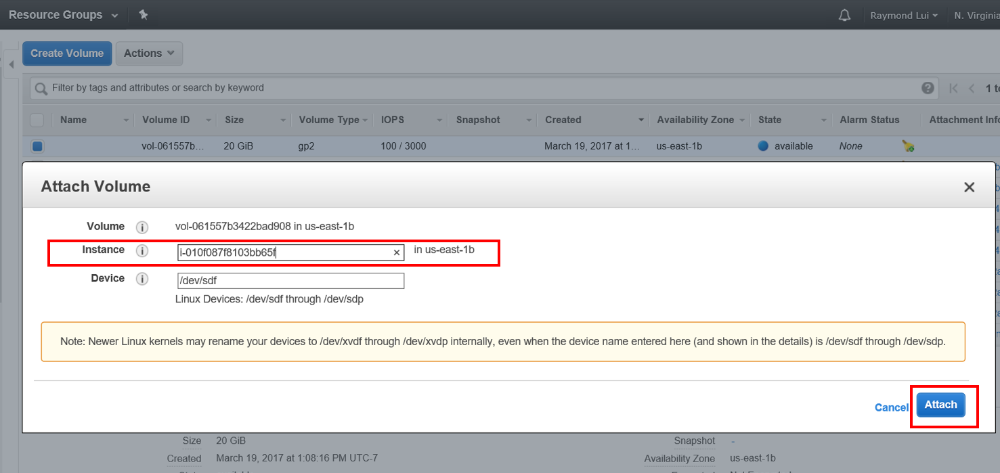{:width="1477px" height="699px"}.

## Step 2: Deploy Portworx

Ssh into each of the EC2 instances and configure docker for shared mount on "/"

```text
 $ ssh -i ~/.ssh/id_rsa ec2-user@52.91.191.220
 $ sudo mount --make-shared /
 $ sudo sed -i.bak -e \
        's:^\(\ \+\)"$unshare" -m -- nohup:\1"$unshare" -m --propagation shared -- nohup:' \
         /etc/init.d/docker
 $ sudo service docker restart
```

Run Portworx on each ECS instance. Portworx will use the EBS volumes you provisioned in step 4. You will need the etcd be running, and you can use container for your etcd.

```text
 docker run --name etcd01 -v /data/varlib/etcd -p 4001:4001 -d portworx/etcd:latest
```

Launch PX containers, you will have to log into each of ECS instance and run the following command for this step. Change the etcd IP and cluster ID for your PX cluster deployment.

```text
  $ sudo docker run --restart=always --name px -d --net=host \
               --privileged=true                             \
               -v /run/docker/plugins:/run/docker/plugins    \
               -v /var/lib/osd:/var/lib/osd:shared           \
               -v /dev:/dev                                  \
               -v /etc/pwx:/etc/pwx                          \
               -v /opt/pwx/bin:/export_bin:shared            \
               -v /var/run/docker.sock:/var/run/docker.sock  \
               -v /var/cores:/var/cores                      \
               -v /usr/src:/usr/src                          \
               portworx/px-dev -daemon -k etcd://172.31.31.61:4001 -c MY_CLUSTER_ID -a -z -f
```

On above the etcd is also deployed as in docker container and is running on one of the EC2 instance; thus the etcd IP is using the internal IP address of the EC2 instance "172.31.31.61".

## Step 3: Setup ECS task with PX volume from ECS CLI workstation

From your linux workstation download and setup AWS ECS CLI utilities

1. Download and install ECS CLI \([detail instructions](http://docs.aws.amazon.com/AmazonECS/latest/developerguide/ECS_CLI_installation.html)\)

   ```text
   $ sudo curl -o /usr/local/bin/ecs-cli https://s3.amazonaws.com/amazon-ecs-cli/ecs-cli-linux-amd64-latest
   $ sudo chmod +x /usr/local/bin/ecs-cli
   ```

2. Configure AWS ECS CLI on your workstation

   ```text
   $ export AWS_ACCESS_KEY_ID=XXXXXXXXXXXXXXXXXX
   $ export AWS_SECRET_ACCESS_KEY=XXXXXXXXXXXXXXXXX
   $ ecs-cli configure --region us-east-1 --access-key $AWS_ACCESS_KEY_ID --secret-key $AWS_SECRET_ACCESS_KEY --cluster ecs-demo1
   ```

3. Create a 1GB PX volume using the Docker CLI. Ssh into one of the ECS instances and create this PX volumes.

```text
     $ ssh -i ~/.ssh/id_rsa ec2-user@52.91.191.220
     $ docker volume create -d pxd --name=demovol --opt size=1 --opt repl=3 --opt shared=true 
     demovol

     $ docker volume ls
     DRIVER              VOLUME NAME
     pxd                 demovol
```

1. From your ECS CLI workstation which has ecs-cli command; setup and launch ECS task definition with previously created PX volume. Create a task definition file "redis.yml" which will launch two containers: redis based on redis image, and web based on binocarlos/moby-counter. Then use ecs-cli command to post this task definition and launch it.

   ```text
   $ cat redis.yml
   web:
   image: binocarlos/moby-counter
   links:
     -  redis:redis
   redis:
   image: redis
   volumes:
     -  demovol:/data
     -  
   $ ecs-cli compose --file redis.yml up 
   INFO[0001] Using ECS task definition                     TaskDefinition="ecscompose-root:1"
   INFO[0001] Starting container...                         container="59701c44-c267-4c85-a8c0-ff87910af535/web"
   INFO[0001] Starting container...                         container="59701c44-c267-4c85-a8c0-ff87910af535/redis"
   INFO[0001] Describe ECS container status                 container="59701c44-c267-4c85-a8c0-ff87910af535/redis" desiredStatus=RUNNING lastStatus=PENDING taskDefinition="ecscompose-root:1"
   INFO[0001] Describe ECS container status                 container="59701c44-c267-4c85-a8c0-ff87910af535/web" desiredStatus=RUNNING lastStatus=PENDING taskDefinition="ecscompose-root:1"
   INFO[0013] Started container...                          container="59701c44-c267-4c85-a8c0-ff87910af535/redis" desiredStatus=RUNNING lastStatus=RUNNING taskDefinition="ecscompose-root:1"
   INFO[0013] Started container...                          container="59701c44-c267-4c85-a8c0-ff87910af535/web" desiredStatus=RUNNING lastStatus=RUNNING taskDefinition="ecscompose-root:1"

   $ ecs-cli ps
   Name                                               State    Ports                                                          TaskDefinition
   59701c44-c267-4c85-a8c0-ff87910af535/redis         RUNNING                                                                 ecscompose-root:1
   59701c44-c267-4c85-a8c0-ff87910af535/web           RUNNING                                                                 ecscompose-root:1
   ```

2. You can also view the task status in the ECS console.

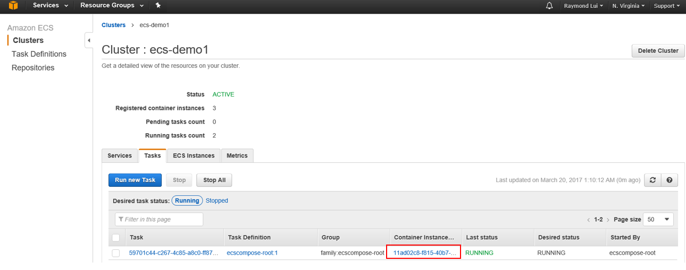{:width="1290px" height="509px"} 6. On the above ECS console, Clusters -&gt; pick your cluster `ecs-demo1` and click on the `Container Instance` ID that corresponding to the running task. This will display the containers information including where are these containers deployed into which EC2 instance. Below, we find that the task defined containers are deployed on EC2 instance with public IP address `52.91.191.220`. 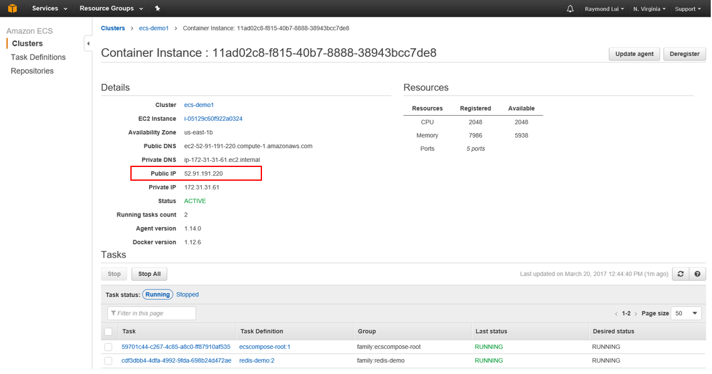{:width="1136px" height="598px"} 7. From above, ssh into the EC2 instance 52.91.191.220 and verify PX volume is attached to running container.

```text
     [ec2-user@ip-172-31-31-61 ~]$ sudo docker ps -a
     CONTAINER ID        IMAGE                            COMMAND                  CREATED             STATUS              PORTS                                             NAMES
     7ba93d51918b        binocarlos/moby-counter          "node index.js"          12 hours ago        Up 12 hours         80/tcp                                            ecs-ecscompose-root-1-web-c2fbfff3bf92b1dad401
     e25ba9131f9b        redis                            "docker-entrypoint.sh"   12 hours ago        Up 12 hours         6379/tcp                                          ecs-ecscompose-root-1-redis-a6a6a2fcb4a6d188e601         

     [ec2-user@ip-172-31-31-61 ~]$ sudo /opt/pwx/bin/pxctl v l
     ID                      NAME                    SIZE    HA      SHARED  ENCRYPTED       IO_PRIORITY     SCALE   STATUS
     1061916907972944739     demovol                 1 GiB   3       yes     no              LOW             0       up - attached on 172.31.31.61
```

1. Check the redis container `ecs-ecscompose-root-1-redis-a6a6a2fcb4a6d188e601` and verify a 1GB pxfs volume is mounted on /data

   ```text
   [ec2-user@ip-172-31-31-61 ~]$ sudo docker exec -it ecs-ecscompose-root-1-redis-a6a6a2fcb4a6d188e601 sh -c 'df -kh'
   Filesystem                                                                                        Size  Used Avail Use% Mounted on
   /dev/mapper/docker-202:1-263203-3f7e353e23d7ba722fc74d1fb7db60e34f98933355ac65f78e6b4f2bcde19778  9.8G  215M  9.0G   3% /
   tmpfs                                                                                             3.9G     0  3.9G   0% /dev
   tmpfs                                                                                             3.9G     0  3.9G   0% /sys/fs/cgroup
   pxfs                                                                                              976M  2.5M  907M   1% /data
   /dev/xvda1                                                                                        7.8G  1.3G  6.5G  16% /etc/hosts
   shm                                                                                                64M     0   64M   0% /dev/shm
   ```

## Step 4: Setup ECS task with PX volume via AWS ECS console

### Optional: the same process of step3 but do it on AWS GUI

Create a ECS tasks definition directly via the ECS console \(GUI\) and using PX volume.

1. Ssh into one of the EC2 instance and create a new PX volume using Docker CLI.

   ```text
    $ docker volume create -d pxd --name=demovol --opt size=1 --opt repl=3 --opt shared=true
   ```

2. In AWS ECS console, choose the previously created cluster `ecs-demo1`; then create a new task definition.

   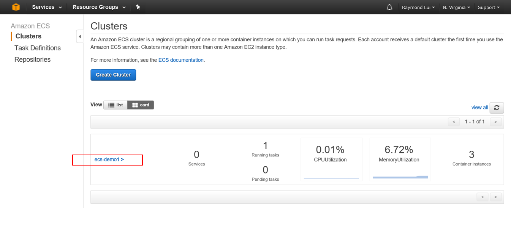{:width="1345px" height="594px"}

3. From the new task definition screen, enter the task definition name `redis-demo` and click `Add volume` near the bottom of the page.

   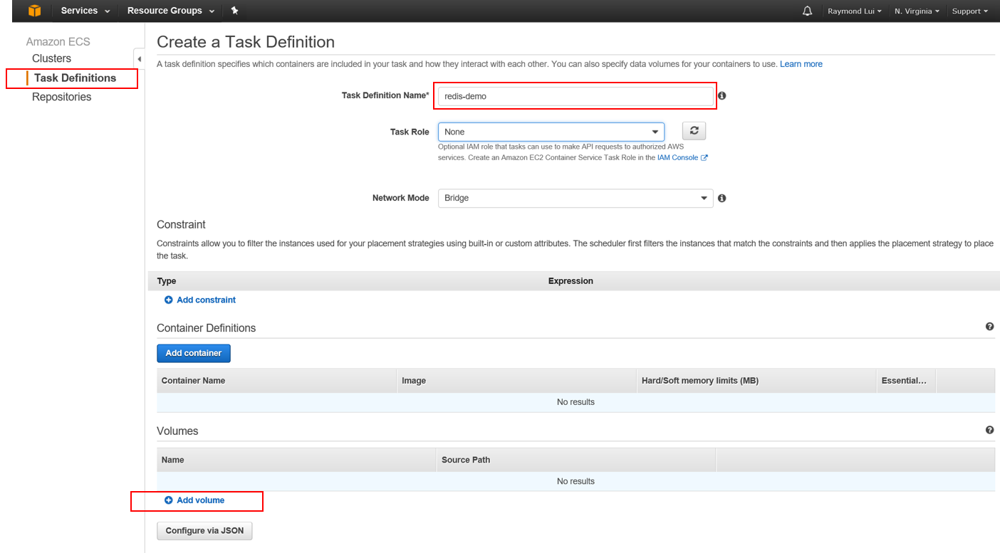{:width="1404px" height="777px"}

4. Enter the `Name` in the Add volume screen, that is just the name for your volume defined in this task definition and no need to be the same as the PX volume name. Then enter the `Source path`, and this is the PX volume name `demovol`.

   {:width="1531px" height="485px"}

5. After added the volume, click `Add container` button to define your containers specification.

   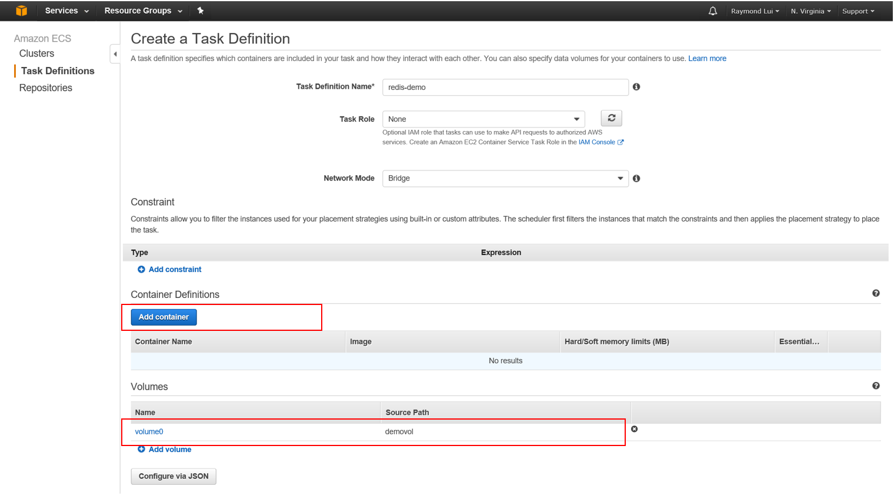{:width="1520px" height="844px"}

6. From the `Add container` screen, enter the `Container name` "redis"  and `Image*` "redis" ; then click the `Add` button.

   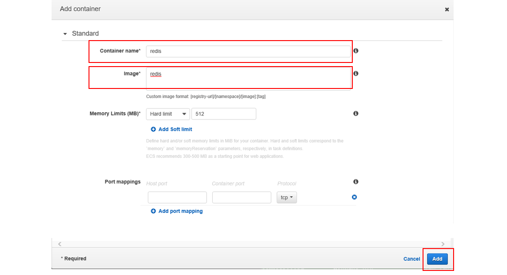{:width="1111px" height="603px"}

7. Adding another container, on the same  Create a Task Definition screen, click `Add container` button. On the Add container screen, enter the `Container name` "web" and `Image*` ["binocarlos/moby-counter"](https://hub.docker.com/r/binocarlos/moby-counter/) and On `NETWORK SETTINGS` `Links` enter "redis:redis" ; then on `STORAEE AND LOGGING` `Mount Points` select from drop down "volume0" and enter the `Container path` "/data" ; and then click `Add` button.

   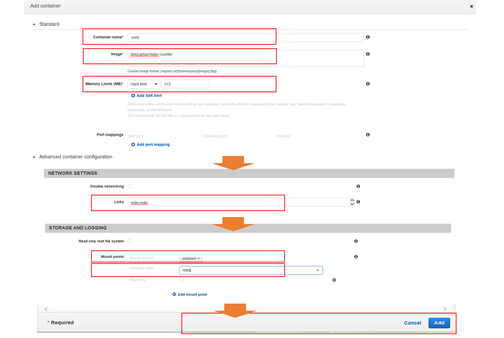{:width="1422px" height="953px"}

8. On the same task definition screen, click `create` button at the of the screen.

   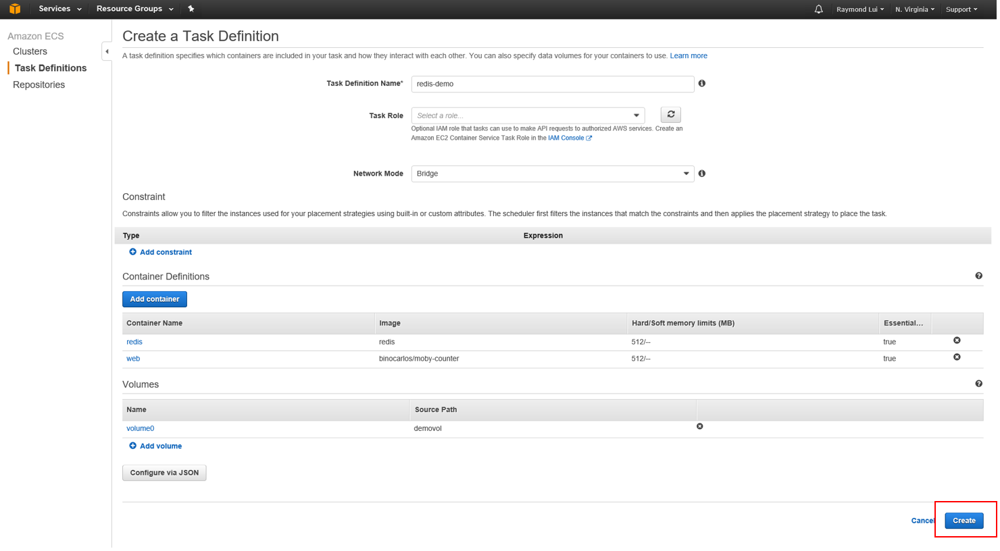{:width="1480px" height="816px"}

9. From the AWS ECS console, Task Definitions, select the definition "redis-demo" and click `Actions` and select `run`

   {:width="1510px" height="404px"}

10. Click `Run Task`

    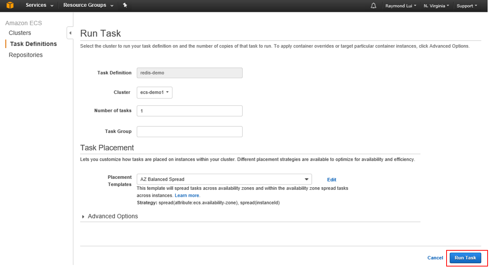{:width="1304px" height="713px"}

11. You will see the task is submitted and change status from `PENDING` to `RUNNING`.

    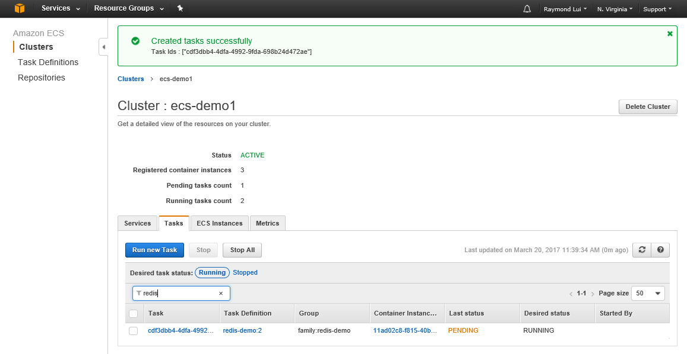{:width="1157px" height="598px"}

    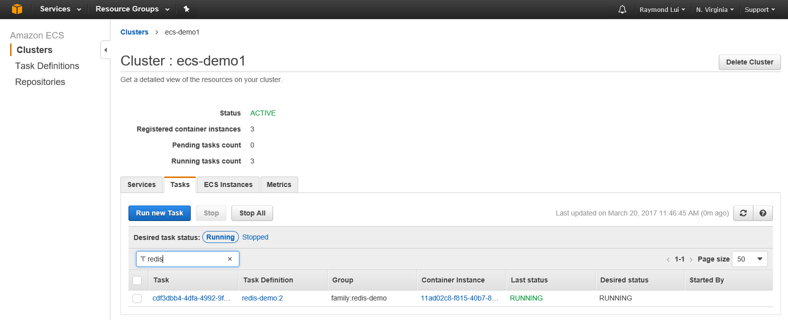{:width="1570px" height="640px"}  

