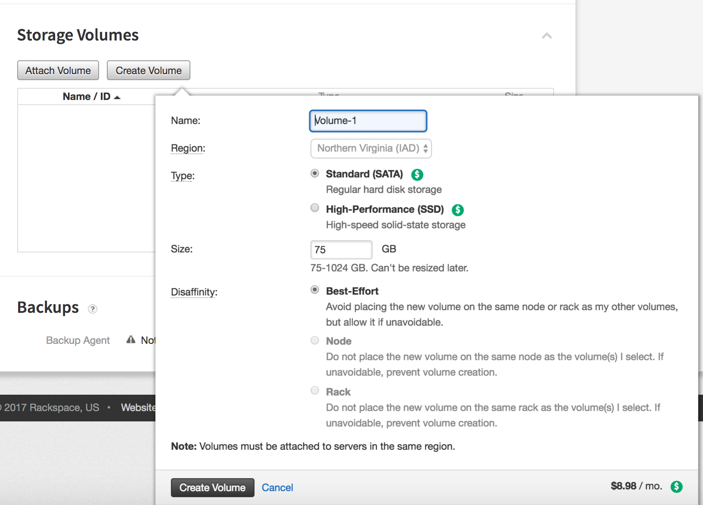
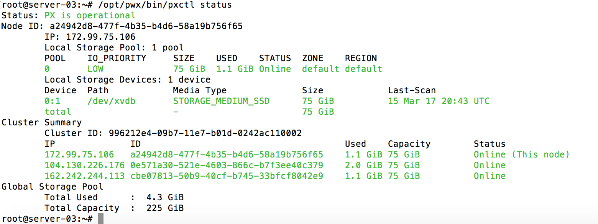
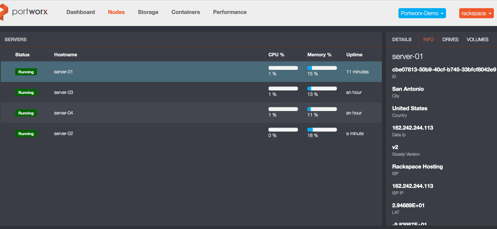

# rackspace

* TOC

  {:toc}

This guide show you how you can easily deploy Portworx on [**Rackspace**](http://https://www.rackspace.com/login)

## Step 1: Provision Cloud Server

When chosing an instance, verify that you meet the [minimum requirements](https://github.com/venkatpx/px-docs/tree/3f39ba94d6d6d91385dcd6792eb6da61d0016b4d/getting-started/px-enterprise.html#step-1-verify-requirements)

Detailed Rackspace steps to build a [cloud server](https://support.rackspace.com/how-to/create-a-cloud-server/) Portworx recommends a minimum cluster of 3 nodes

## Step 2. Create a volume and attach it to a Rackspace VM

Follow the instuctions from Rackspace documentation [Create and attach a Cloud Block Storage volume](https://support.rackspace.com/how-to/create-and-attach-a-cloud-block-storage-volume/)

Your deployment will look something like the following:

{:width="1632px" height="1172px"}

Note: Volume cannot not be attached until the server is available

## Step 3: Install Docker for the appropriate OS Version

Portworx recommends Docker 1.12 with [Device Mapper](https://docs.docker.com/engine/userguide/storagedriver/device-mapper-driver/#/configure-docker-with-devicemapper).

Note: Portworx requires Docker to allow shared mounts. This is standard as of Docker 1.12.  
If you are running Docker without shared mounts, please follow the steps listed [here](https://github.com/venkatpx/px-docs/tree/3f39ba94d6d6d91385dcd6792eb6da61d0016b4d/knowledgebase/shared-mount-propogation.html)

## Step 4: Launch PX-Enterprise

Note: Before installing Portworx you will need to open ports as per [minimum requirements](https://github.com/venkatpx/px-docs/tree/3f39ba94d6d6d91385dcd6792eb6da61d0016b4d/getting-started/px-enterprise.html#step-1-verify-requirements) on the local firewall. You can view Rackspaces [firewall documentation](https://support.rackspace.com/how-to/open-ports-in-the-linux-firewall-to-access-pop-and-imap-mail-servers/)

[Follow the instructions to launch PX-Enterprise](https://github.com/venkatpx/px-docs/tree/3f39ba94d6d6d91385dcd6792eb6da61d0016b4d/getting-started/px-enterprise.html)

Use the docker run command to launch PX-Enterprise, substituting the appropriate multipath devices and network interfaces, as identified from the previous steps.

Alternatively, you can either run the 'px\_bootstrap' script from curl, or construct your own [config.json](https://github.com/venkatpx/px-docs/tree/3f39ba94d6d6d91385dcd6792eb6da61d0016b4d/control/config-json.html) file.

From the server node running px-enterprise container, you should see the following status:

{:width="1560px" height="586px"}

You should also be able to monitor cluster from PX-Enterprise console:

{:width="2552px" height="1180px"}

