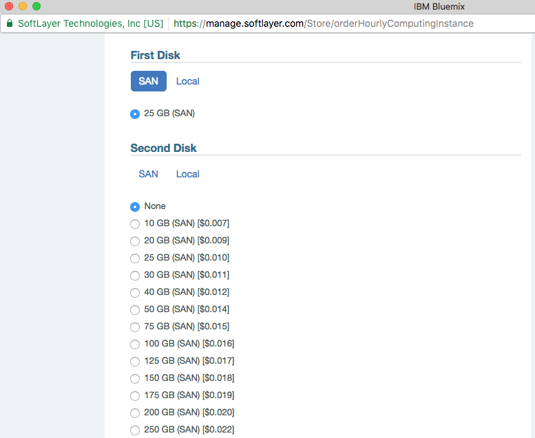
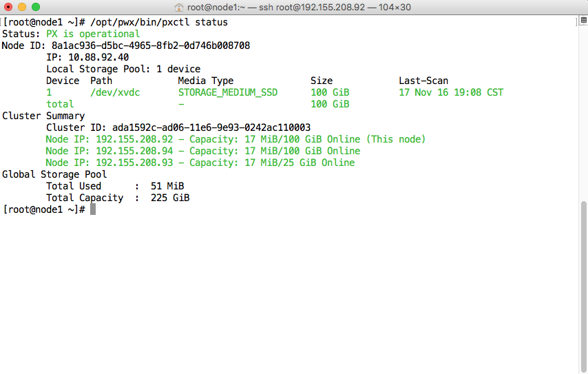
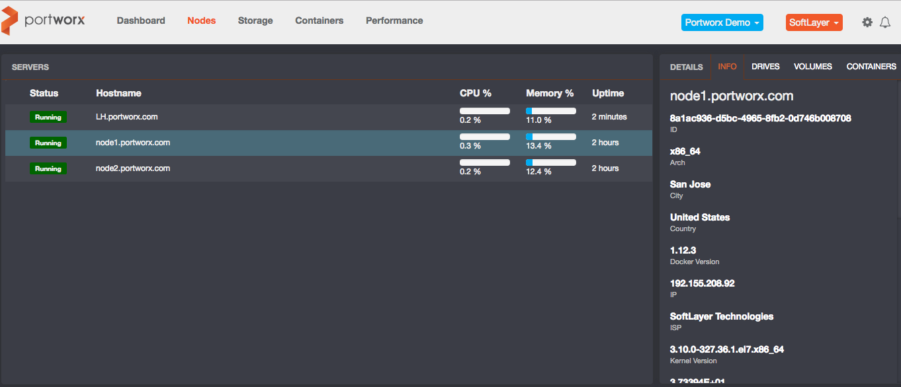

# softlayer

* TOC

  {:toc}

This guide shows you how you can easily deploy Portworx on [**SoftLayer**](http://www.softlayer.com/)

## Step 1: Provision Virtual Machine

When chosing an instance, verify that you meet the [minimum requirements](https://github.com/venkatpx/px-docs/tree/3f39ba94d6d6d91385dcd6792eb6da61d0016b4d/getting-started/px-enterprise.html#step-1-verify-requirements)

Portworx recommends a minimum cluster size of 3 nodes.

## Step 2: Attach Data Disk to SoftLayer VM

SoftLayer lets you choose either local disk or SAN disk. If your environment have nodes with both of these, make sure that there is network connectivity between the nodes.

{:width="777px" height="637px"}

## Step 3: Install Docker for the appropriate OS Version

Portworx recommends Docker 1.12 with [Device Mapper](https://docs.docker.com/engine/userguide/storagedriver/device-mapper-driver/#/configure-docker-with-devicemapper).

Note: Portworx requires Docker to allow shared mounts. This is standard as of Docker 1.12.  
If you are running Docker without shared mounts, please follow the steps listed [here](https://github.com/venkatpx/px-docs/tree/3f39ba94d6d6d91385dcd6792eb6da61d0016b4d/knowledgebase/shared-mount-propogation.html)

## Step 4: Launch PX-Enterprise

[Follow the instructions to launch PX-Enterprise](https://github.com/venkatpx/px-docs/tree/3f39ba94d6d6d91385dcd6792eb6da61d0016b4d/getting-started/px-enterprise.html)

Use the docker run command to launch PX-Enterprise, substituting the appropriate multipath devices and network interfaces, as identified from the previous steps.

Alternatively, you can either run the 'px\_bootstrap' script from curl, or construct your own [config.json](https://github.com/venkatpx/px-docs/tree/3f39ba94d6d6d91385dcd6792eb6da61d0016b4d/control/config-json.html) file.

From the server node running px-enterprise container, you should see the following status:

{:width="854px" height="543px"}

You should also be able to monitor cluster from PX-Enterprise console:

{:width="1362px" height="586px"}

