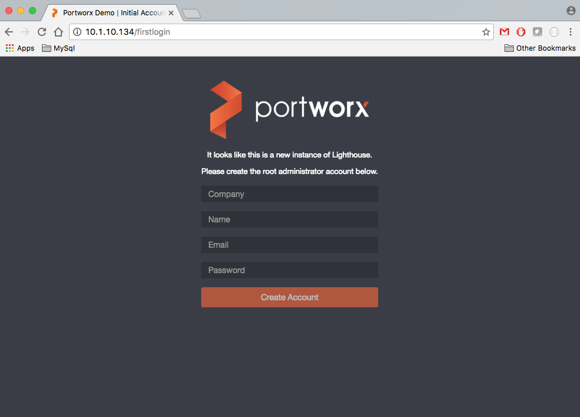

# lighthouse-with-secure-etcd

* TOC

  {:toc}

This guide shows you how you can run [PX-Enterprise Console](http://lighthouse.portworx.com/) locally with secure etcd.

Lighthouse supports etcd2 auth features as the following   
1. You can use SSL for connecting to etcd : Use a CA file and/or a Certificate-Key pair   
2. You can enable auth in etcd and provide username and password as well. This user should have read/write access to etcd   
3. Provide all above options as commandline arguments to docker run command for lighthouse

Note: The example in this section uses Amazon Web Services \(AWS\) Elastic Compute Cloud \(EC2\) for servers in the cluster. In your deployment, you can use physical servers, another public cloud, or virtual machines.

## Prerequisite \#1 - Launch Server

To start, create one server, following these requirements:

* Image: Must support Docker 1.10 or later, such as:
  * [Red Hat 7.2 \(HVM\)](https://aws.amazon.com/marketplace/pp/B019NS7T5I) or CentOS
  * [Ubuntu 16.04 \(HVM\)](https://aws.amazon.com/marketplace/pp/B01JBL2M0O)
  * [Ubuntu 14.04 \(HVM\)](https://aws.amazon.com/marketplace/pp/B00JV9TBA6)
* Instance type: c3.xlarge
* Number of instances: 1
* Storage:
  * /dev/xvda: 8 GB boot device
* Tag \(optional\): Add value **px-lighthouse** as the name

## Prerequisite \#2 - Install and configure Docker

1. Follow the Docker [install guide](https://docs.docker.com/engine/installation/) to install and start the Docker Service.
2. Verify that your Docker version is 1.10 or later.

## Component Install Step \#1: Install InfluxDB

> **Important:**   
>  For PX-Lighthouse, output required from this step:   
>  Connection string in '[http://{ADMIN\_USER}:{ADMIN\_PASSWORD}@{IP\_Address}:8086](http://{ADMIN_USER}:{ADMIN_PASSWORD}@{IP_Address}:8086)' format   
>  ADMIN\_USER: Admin username of influxdb for $PWX\_INFLUXUSR   
>  INFLUXDB\_INIT\_PWD: Password of admin user for $PWX\_INFLUXPW

Lighthouse requires access to InfluxDB for tracking statistics.

Either

* [Use InfluxCloud](https://cloud.influxdata.com/)

or

* [Run InfluxDB as a docker container](https://github.com/tutumcloud/influxdb)

for configuring InfluxDB access for Lighthouse

Example docker command to run influxdb in a container:

```text
sudo docker run -d -p 8083:8083 -p 8086:8086 --restart always \
     --name influxdb                                          \
     -e ADMIN_USER="admin"                                    \
     -e INFLUXDB_INIT_PWD="password"                          \
     -e PRE_CREATE_DB="px_stats" tutum/influxdb:latest
```

## Component Install Step \#2A: Install etcd2 with a CA file and/or a Certificate-Key pair

* You can have CA file and/or a Certificate-Key pair for you etcd2 server. There is an example document at [Etcd with Encryption and Authentication](https://medium.com/@gargar454/coreos-etcd-and-fleet-with-encryption-and-authentication-27ffefd0785c#.w24dog98z)
* Lighthouse requires that you pass the certs into the container using persistant storage and you map them to '/etc/pwx' path using -v option

## Component Install Step \#2B: Enable Auth in etcd2

* You can enable authentication in etcd2, using the guide [here](https://coreos.com/etcd/docs/latest/authentication.html)

## Component Install Step \#2C: Start etcd2 server

> **Important:**   
>  For PX-Lighthouse, output required from this step:   
> Connection string in 'etcd:[http://{IP\_ADDRESS}:2379](http://{IP_ADDRESS}:2379)' format

## Component Install Step \#3: Run the PX-Lighthouse container

For **ETCD2**, start the PX-Lighthouse container with the following run command:

```text
Sudo docker run -d -p 80:80 -v /etc/ssl:/etc/pwx --restart always  \
-e PWX_KVDB_CA_PATH="/etc/ssl/ca.crt"                              \
-e PWX_KVDB_USER_CERT_KEY_PATH="/etc/ssl/key.key"                  \
-e PWX_KVDB_USER_CERT_PATH="/etc/ssl/key.crt"                      \
-e PWX_KVDB_USER_PWD="etcd2username:password"                      \
-e PWX_KVDB_AUTH="true"                                            \
--name px-lighthouse portworx/px-lighthouse                        \
-d http://admin:password1@${LOCAL_IP}:8086                         \
-k etcd:https://${LOCAL_IP}:2379
```

Runtime command options

```text
-v /etc/ssl:/etc/pwx
   > certs files location mapped as /etc/pwx
-d http://{ADMIN_USER}:{ADMIN_PASSWORD}@{IP_Address}:8086
   > Connection string of your influx db
-k {etcd/consul}:http://{IP_Address}:{Port_NO}
   > Connection string of your kbdb.
   > Note: Specify port 2379 for etcd
```

The following environment variables are available for px-lighthouse:

```text
PWX_KVDB                    KVDB URL:PORT without username:password
PWX_KVDB_AUTH               'true' or 'false', to enable or disable auth 
PWX_KVDB_CA_PATH            Absolute path to host ca cert(e.g. /etc/ssl/ca.crt)
PWX_KVDB_USER_CERT_KEY_PATH Absolute path to host's certificate file (e.g. /etc/ssl/key.cert)
PWX_KVDB_USER_CERT_PATH     Absolute path to host's private key (e.g. /etc/ssl/key.key)
PWX_KVDB_USER_PWD           Username and password for etcd2 as username:password
PWX_INFLUXDB                Influx URL:PORT without username:password
PWX_INFLUXUSR               Influx username
PWX_INFLUXPW                Influx password

(Note: If you are specifying PWX_KVDB_USER_PWD, then PWX_KVDB_AUTH needs to be set as true)
```

In your browser visit [http://{IP\_ADDRESS}:80](http://{IP_ADDRESS}:80) to access your locally running PX-Lighthouse.

{:width="983px" height="707px"}

