# portworx-via-lighthouse

* TOC

  {:toc}

Lighthouse is a management and GUI service that allows you to create PX clusters and launch PX nodes to join your clusters. You can then manage your PX clusters via the Lighthouse web interface.

This section walks through installing and configuring a PX-Enterprise cluster via Lighthouse. In this example, you run the PX-Enterprise Docker container on server nodes. Running the container enables PX-Enterprise to aggregate storage capacity and monitor hardware for degradation and failure. Server nodes are joined into a cluster for the sake of high availability. You can use direct attached disks, storage arrays, or cloud volumes for the underlying storage.

## Step 1: Provision a cluster in the PX-Enterprise console

Log in to the PX-Enterprise Lighthouse console. If a cluster has not already been created for your account, click the **Manage Clusters** menu and then click **Manage Clusters**.

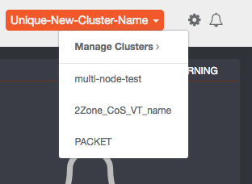{:width="312px" height="228px"}

On the **Clusters** page, click the **+** icon to create a new storage cluster.

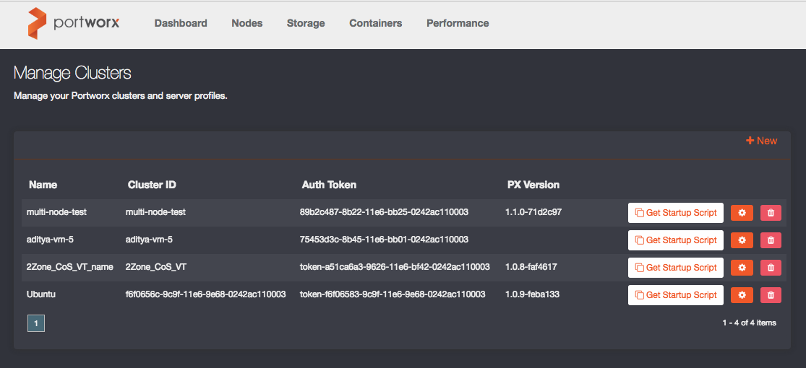{:width="1115px" height="510px"}

Then, type a unique Name for your PX-Enterprise cluster and click **Create**.

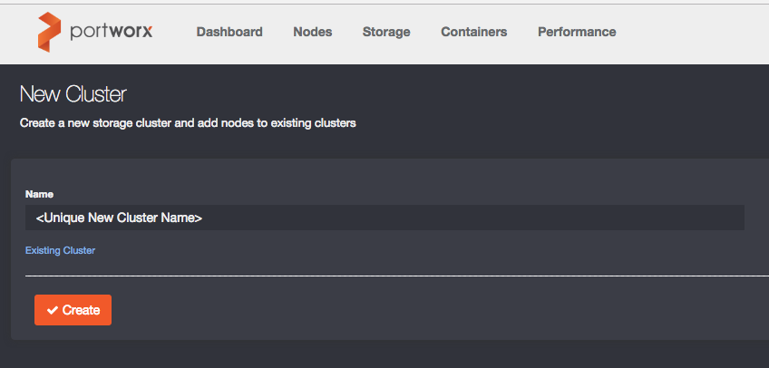{:width="848px" height="406px"}

\(Don't use the "Existing Cluster" option, unless directed by Portworx Support.\)

The new cluster appears in the Clusters list.

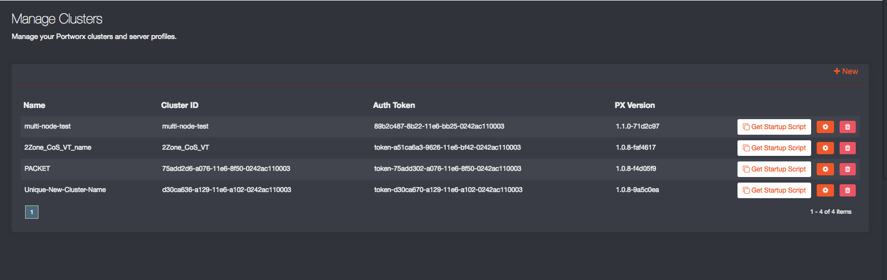{:width="1590px" height="503px"}

## Step 2: Run discovery and bootstrap on a server node

You will now add your first server node to the storage cluster. On the **Clusters** page, click **Get Startup Script** for the cluster you just created.

{:width="1590px" height="503px"}

A window containing a `curl` command opens. The following `curl` example includes an authentication token and downloads the PX-Enterprise Docker container.

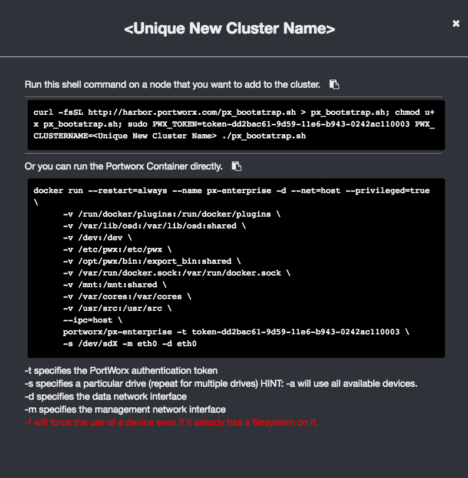{:width="794px" height="812px"}

Log in to each node that will install PX-Enterprise and join the cluster. Open a terminal window and run as `root` or `sudo su` to give privileges. On your system, copy the `curl` string provided by the pop-up window and paste it into a terminal session and press Enter, as shown below.

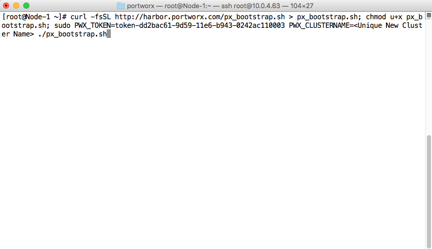{:width="854px" height="492px"}

## Step 3: Configure the Hardware Profile

The bootstrap startup script discovers the server/node configuration. It lets you specify which storage and network elements you want to participate in PX-Enterprise.

First menu is _**Storage Selection Menu**_ You can either pick individual storage devices or can choose to add all devices.

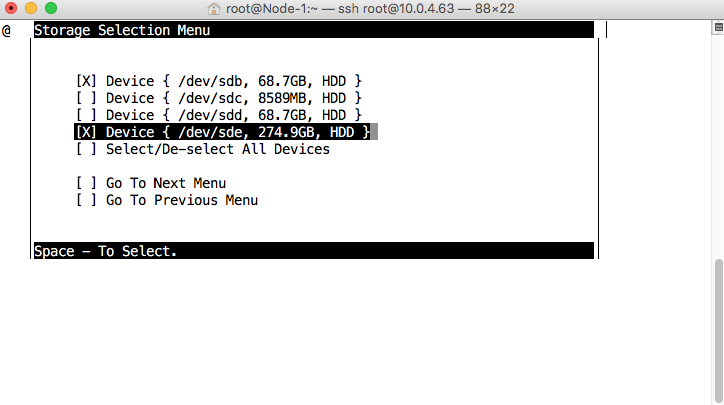{:width="724px" height="405px"}

Second menu is _**Data Network Interface Selection Menu**_ This will let you assign one of your network interfaces as data interface for your this node. The _data interface_ is used between server nodes, primarily for data transfer as part of data availability \(that is, multi-node data replication\).

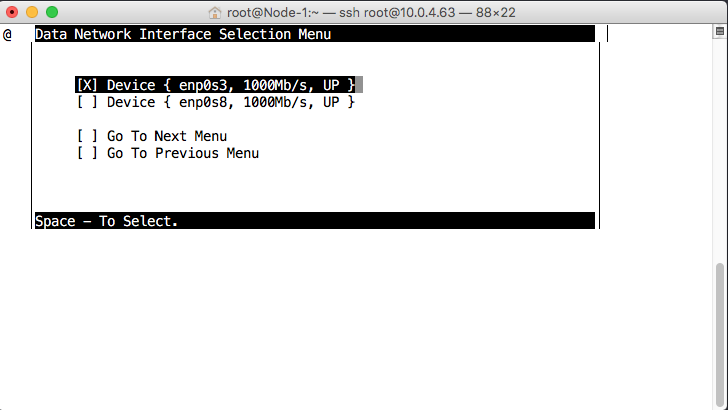{:width="728px" height="410px"}

Last menu is _**Management Network Interface Selection Menu**_ This will let you assign one of your network interfaces as management interface for your this PX node. The _management interface_ is used for communication between the hosted PX-Enterprise product and the individual server nodes, for control-path as well as statistics and metrics.

Note: You can choose to use the same interface both for data interface and management interface.PX-Enterprise requires at least one NIC and only needs a maximum of two NICs.

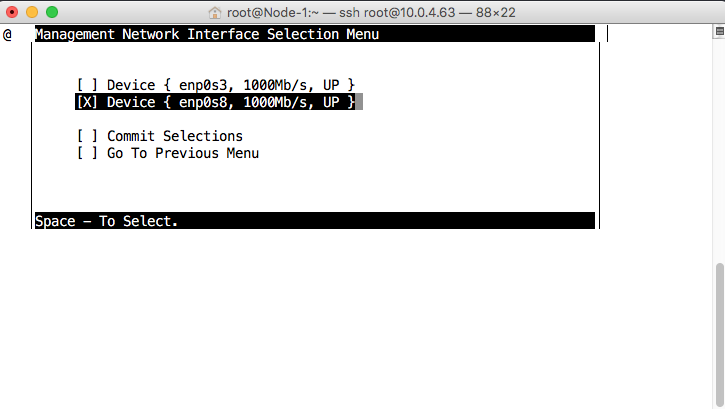{:width="725px" height="409px"}

To instruct the PX-Enterprise container on the server node to complete the installation, click **Commit Selections** on the Management Network Interface Selection Menu. Upon installation, PX-Enterprise aggregates the specified storage and uses the network interfaces selected.

From the server node that ran the `curl` command, you should see the following status:

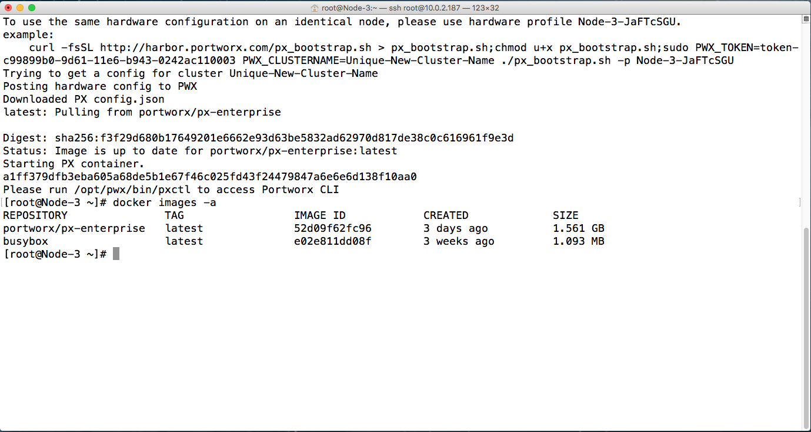{:width="1379px" height="736px"}

Bootstrap script also saves your selection as a unique _Hardware Profile_. You can reference this on any other node where you want to run PX-Enterprise with the same storage and network elements.

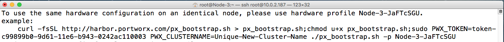{:width="1379px" height="118px"}

## Step 4: Expand the cluster

You can add new servers nodes to the existing cluster by running the bootstrap script for a cluster. Server nodes can have different Server Profiles, where some servers might contribute little or no storage to the cluster.

> **Important:**  
> For server node connections, use a low-latency network, as opposed to spanning a WAN. For more details, see [Step 1: Verify requirements](https://github.com/venkatpx/px-docs/tree/3f39ba94d6d6d91385dcd6792eb6da61d0016b4d/getting-started/px-developer.html#step-1-verify-requirements).

At this point you will have a PX-Enterprise cluster that you will be able to monitor from PX-Enterprise console.

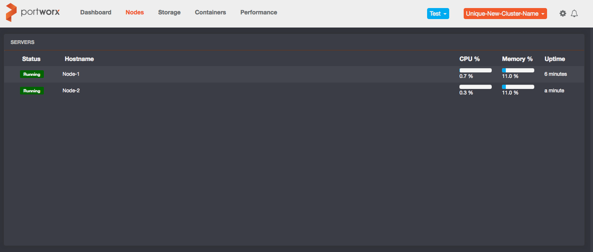{:width="1394px" height="595px"}

