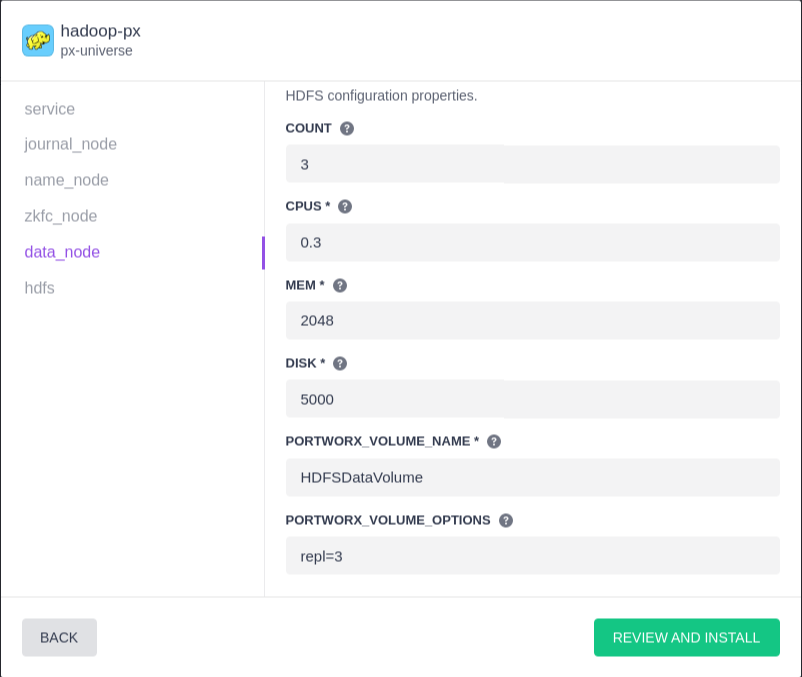
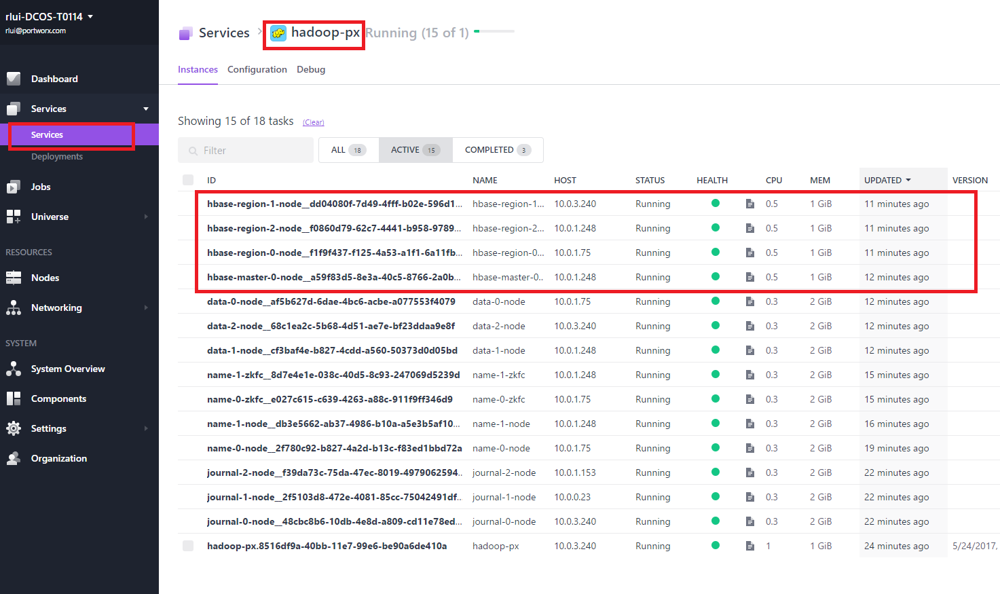
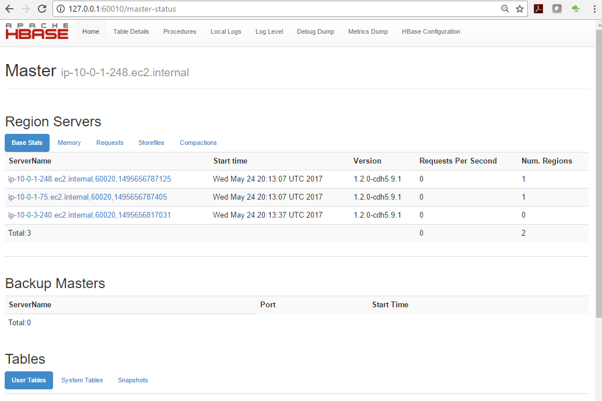
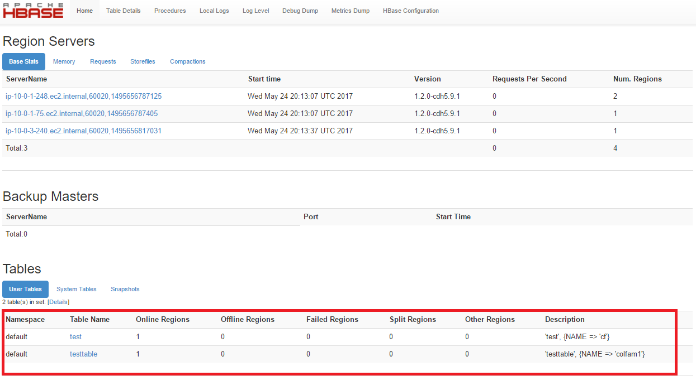

# hbase-px

* TOC

  {:toc}

This guide describe how to use `HBase` from `px-universe` latest `hadoop-px` package on DCOS cluster. Assume you have successfully deployed DCOS and PX cluster.

## Adding the repository for the service:

For this step you will need to login to a node which has the dcos cli installed and is authenticated to your DCOS cluster.

Run the following command to add the repository to your DCOS cluster:

```text
 $ dcos package repo add --index=0 hadoop-px-aws https://disrani-dcos.s3.amazonaws.com/v1/hadoop-px/hadoop-px.zip
```

Once you have run the above command you should see the Hadoop-PX service available in your universe

## Installation

### Default Install

If you want to use the defaults, you can now run the dcos command to install the service

```text
$ dcos package install --yes hadoop-px
```

You can also click on the “Install” button on the WebUI next to the service and then click “Install Package”.

### Advanced Install

If you want to modify the default, click on the “Install” button next to the package on the DCOS UI and then click on “Advanced Installation”

Here you have the option to change the service name, volume name, volume size, and provide any additional options that you want to pass to the docker volume driver. You can also configure other Hadoop related parameters on this page including the number of Data and Yarn nodes for the Hadoop clsuter.

{:width="655px" height="200px"}

Click on “Review and Install” and then “Install” to start the installation of the service.

## Verifying Install

Once you have started the install you can go to the Services page to monitor the status of the installation from the DCOS service screen, one hbase master server task and three hbase region server tasks should be observed when installation of hadoop-px is completed.



From the DCOS workstation; check hbase task containers

```text
$ dcos task | head -1 && dcos task  |grep hbase
NAME                 HOST        USER  STATE  ID
hbase-master-0-node  10.0.1.248  root    R    hbase-master-0-node__a59f83d5-8e3a-40c5-8766-2a0be11b24ea
hbase-region-0-node  10.0.1.75   root    R    hbase-region-0-node__f1f9f437-f125-4a53-a1f1-6a11fbbcabf4
hbase-region-1-node  10.0.3.240  root    R    hbase-region-1-node__dd04080f-7d49-4fff-b02e-596d10ad620a
hbase-region-2-node  10.0.1.248  root    R    hbase-region-2-node__f0860d79-62c7-4441-b958-978924b3b9d5
```

From the DCOS workstation, install new dcos command for hdfs

```text
$ dcos package install hdfs --cli
```

Use the dcos command and inspect the hbase-site.xml file and look for the property of `hbase.master.info.port`.

```text
$ dcos hdfs endpoints hbase-site.xml
```

The section of `hbase.master.info.port` in hbase-site.xml

hbase.master.info.port60010The port for the HBase Master web UI. Set to -1 if you do not want a UI instance run.

The default setup for master web UI access is master node IP at port `60010`.

## Accessing to Hbase Master UI

Create a ssh tunnel from the DCOS/Mesos master node and access to hbase master node port 60010. The DCOS/Mesos master node = `ec2-52-91-237-197.compute-1.amazonaws.com` and the hbase master node is obtained previously from dcos task command and is `10.0.1.248`

```text
ssh -i awskey -L 60010:10.0.1.248:60010 core@ec2-52-91-237-197.compute-1.amazonaws.com
```

From the browser; you can inspect the setup of this Hbase cluster. and default setup only has 1 Hbase master and three Hbase region servers, and no backup master node.



## Checking Hbase in CLI

From the Hbase master node, run `hbase hbck` command; before running any hbase command, set JAVA\_HOME.

```text
$ export JAVA_HOME=/mnt/mesos/sandbox/jre1.8.0_112

$ /mnt/mesos/sandbox/hbase-1.2.0-cdh5.9.1/bin/hbase hbck
```

The output of `hbase hbck` is length and Hbase cluster information is observed

```text
 Version: 1.2.0-cdh5.9.1
 Number of live region servers: 3
 Number of dead region servers: 0
 Master: ip-10-0-1-153.ec2.internal,60000,1495666988221
 Number of backup masters: 0
 Average load: 1.3333333333333333
 Number of requests: 0
 Number of regions: 4
 Number of regions in transition: 0
```

And `hbase hbck` also check all table status

```text
 Table hbase:meta is okay.
 Number of regions: 1
 Deployed on:  ip-10-0-1-248.ec2.internal,60020,1495656787125
 Table test is okay.
 Number of regions: 1
 Deployed on:  ip-10-0-1-248.ec2.internal,60020,1495656787125
 Table hbase:namespace is okay.
 Number of regions: 1
 Deployed on:  ip-10-0-3-240.ec2.internal,60020,1495656817031
```

## Using the Hbase Shell

Get into the Hbase master task container from your DCOS workstation

```text
$ dcos task exec -it hbase-master-0-node__a59f83d5-8e3a-40c5-8766-2a0be11b24ea bash
```

From the Hbase master container, export the JAVA\_HOME and run hbase shell; the default JAVA\_HOME is on `/mnt/mesos/sandbox/jre1.8.0_112`

```text
$ export JAVA_HOME=/mnt/mesos/sandbox/jre1.8.0_112

$ /mnt/mesos/sandbox/hbase-1.2.0-cdh5.9.1/bin/hbase shell

  HBase Shell; enter 'help<RETURN>' for list of supported commands.
  Type "exit<RETURN>" to leave the HBase Shell
  Version 1.2.0-cdh5.9.1, rUnknown, Wed Jan 11 13:57:35 PST 2017

hbase(main):001:0>
```

From the hbase shell check the current cluster `status`

```text
 hbase(main):010:0> status
 1 active master, 0 backup masters, 3 servers, 0 dead, 1.0000 average load
```

Create a test table `test`; specify the column family name as `cf`

> create 'test', 'cf' 0 row\(s\) in 2.4460 seconds

```text
 => Hbase::Table - test
```

List created table `test`

> list

```text
  TABLE
  test
  1 row(s) in 0.0060 seconds

 => ["test"]
```

Populate the `test` table with some rows

> put 'test', 'row1', 'cf:a', 'value1' 0 row\(s\) in 0.3090 seconds
>
> put 'test', 'row2', 'cf:b', 'value2' 0 row\(s\) in 0.2000 seconds
>
> put 'test', 'row3', 'cf:c', 'value3' 0 row\(s\) in 0.0120 seconds

Describe the `test` table

> desc 'test' Table test is ENABLED test COLUMN FAMILIES DESCRIPTION {NAME =&gt; 'cf', BLOOMFILTER =&gt; 'ROW', VERSIONS =&gt; '1', IN\_MEMORY =&gt; 'false', KEEP\_DELETED\_CELLS =&gt; 'FALSE', DATA\_BLOCK\_ENCODING =&gt; 'NONE', TTL =&gt; 'FOREVER', COMPRESSION =&gt; 'NONE', MIN\_VERSIONS =&gt; '0', BLOCKCACHE =&gt; 'true', BLOCKSIZE =&gt; '65536', REPLICATION\_SCOPE =&gt; '0'} 1 row\(s\) in 0.1160 seconds

Get a single row from `test` table

> get 'test', 'row1' COLUMN CELL cf:a timestamp=1495664662231, value=value1 1 row\(s\) in 0.0390 seconds

Scan the table `test`

```text
   hbase(main):022:0> scan 'test'
   ROW                                COLUMN+CELL
   row1                               column=cf:a, timestamp=1495664662231, value=value1
   row2                               column=cf:b, timestamp=1495664685630, value=value2
   row3                               column=cf:c, timestamp=1495664706231, value=value3
   3 row(s) in 0.0220 seconds
```

Other hbase shell commands include: `disable`, `enable` and `drop` table.

Create sample table span from row-aa to row-zz with total 676 rows.

> create 'testtable', 'colfam1' for i in 'a'..'z' do for j in 'a'..'z' do  put 'testtable', "row-\#{i}\#{j}", "colfam1:\#{j}", "\#{j}" end end

Scan table `testtable` output is length and the end should be similar like below

```text
  row-zv                             column=colfam1:v, timestamp=1495668892646, value=v
  row-zw                             column=colfam1:w, timestamp=1495668892649, value=w
  row-zx                             column=colfam1:x, timestamp=1495668892652, value=x
  row-zy                             column=colfam1:y, timestamp=1495668892655, value=y
  row-zz                             column=colfam1:z, timestamp=1495668892658, value=z
```

And from the HBase Master UI, the `test` table is listed under User Tables



### HBase file system

The Hbase default file system is using hadoop-px HDFS, from a configured hadoop client use hdfs command to check the default Hbase folder `hbase`

```text
 $ hadoop fs -ls /
   Found 1 items
   drwxr-xr-x   - root supergroup          0 2017-05-24 21:56 /hbase
 $ hadoop fs -ls /hbase
   Found 8 items
   drwxr-xr-x   - root supergroup          0 2017-05-24 20:13 /hbase/.tmp
   drwxr-xr-x   - root supergroup          0 2017-05-24 22:26 /hbase/MasterProcWALs
   drwxr-xr-x   - root supergroup          0 2017-05-24 20:13 /hbase/WALs
   drwxr-xr-x   - root supergroup          0 2017-05-24 22:24 /hbase/archive
   drwxr-xr-x   - root supergroup          0 2017-05-24 20:13 /hbase/data
    -rw-r--r--  3 root supergroup        42 2017-05-24 20:12  /hbase/hbase.id
    -rw-r--r--  3 root supergroup         7 2017-05-24 20:12  /hbase/hbase.version
   drwxr-xr-x   - root supergroup          0 2017-05-24 22:23 /hbase/oldWALs
```

The files associate to the created table `test` are located at HDFS /hbase/data/default/

```text
 $ hadoop fs -ls -R /hbase/data/default/test/
   drwxr-xr-x   - root supergroup          0 2017-05-24 22:21 /hbase/data/default/test/.tabledesc
   -rw-r--r--   3 root supergroup        282 2017-05-24 22:21 /hbase/data/default/test/.tabledesc/.tableinfo.0000000001
   drwxr-xr-x   - root supergroup          0 2017-05-24 22:21 /hbase/data/default/test/.tmp
   drwxr-xr-x   - root supergroup          0 2017-05-24 22:21 /hbase/data/default/test/3c371ba86dbe886839cc5eb38925fa25
   -rw-r--r--   3 root supergroup         39 2017-05-24 22:21 /hbase/data/default/test/3c371ba86dbe886839cc5eb38925fa25/.regioninfo
   drwxr-xr-x   - root supergroup          0 2017-05-24 22:21 /hbase/data/default/test/3c371ba86dbe886839cc5eb38925fa25/cf
   drwxr-xr-x   - root supergroup          0 2017-05-24 22:21 /hbase/data/default/test/3c371ba86dbe886839cc5eb38925fa25/recovered.edits
   -rw-r--r--   3 root supergroup          0 2017-05-24 22:21 /hbase/data/default/test/3c371ba86dbe886839cc5eb38925fa25/recovered.edits/2.seqid
```

## HBase PerformanceEvaluation

Hbase come with a handy tool to test run the Hbase cluster performance. The following example, we use an external hbase client \(machine with hbase binary and all hbase required configurations `hbase-site.xml`, `hdfs-site.xml`, `core-site.xml` \) to run hbase random write performance.

```text
$ time ${HBASE_HOME}/bin/hbase org.apache.hadoop.hbase.PerformanceEvaluation randomWrite 3
```

The above command will run Random Write of 1M rows per hbase slave node into the target `TestTable` ; the number at the end of command specify 3 hbase nodes. The hbase performance evaluation job will run as mapreduce job and the output is length, and at the end you should see the standard result of mapreduce job output.

```text
  2017-05-25 00:56:00,953 INFO  [main] mapreduce.Job: Job job_local877688079_0001 completed successfully
  2017-05-25 00:56:01,079 INFO  [main] mapreduce.Job: Counters: 37
      File System Counters
            FILE: Number of bytes read=964427243
            FILE: Number of bytes written=981709017
            FILE: Number of read operations=0
            FILE: Number of large read operations=0
            FILE: Number of write operations=0
            HDFS: Number of bytes read=2806914
            HDFS: Number of bytes written=568403
            HDFS: Number of read operations=1117
            HDFS: Number of large read operations=0
            HDFS: Number of write operations=95
     Map-Reduce Framework
            Map input records=30
            Map output records=30
            Map output bytes=480
            Map output materialized bytes=720
            Input split bytes=4230
            Combine input records=0
            Combine output records=0
            Reduce input groups=30
            Reduce shuffle bytes=720
            Reduce input records=30
            Reduce output records=30
            Spilled Records=60
            Shuffled Maps =30
            Failed Shuffles=0
            Merged Map outputs=30
            GC time elapsed (ms)=7190
            Total committed heap usage (bytes)=8958365696
     Shuffle Errors
            BAD_ID=0
            CONNECTION=0
            IO_ERROR=0
            WRONG_LENGTH=0
            WRONG_MAP=0
            WRONG_REDUCE=0
     HBase Performance Evaluation
            Elapsed time in milliseconds=171411
            Row count=1048560
     File Input Format Counters
            Bytes Read=125361
     File Output Format Counters
            Bytes Written=359

   real    3m22.431s
   user    1m54.584s
   sys     0m3.688s
```

